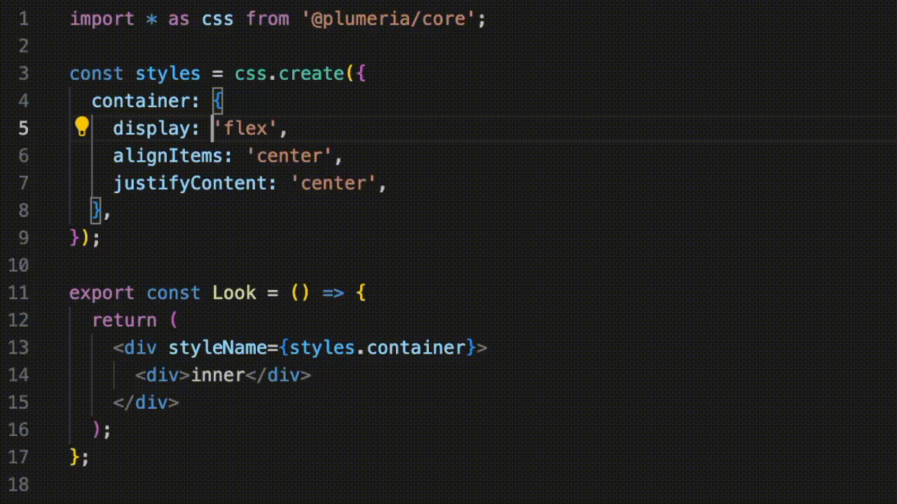

# plumeria 
   

**Plumeria** is a library for developing styled React components for the web. It is a compiler with typed syntax and linting support. The goal of Plumeria is to reduce the load on developers.

## Structure

* `.github`
  * Contains workflows used by GitHub Actions.
  * Contains other templates.
* `examples`
  * Example applications using Plumeria.
* `packages`
  * Contains the individual packages managed in the monorepo.
  * [compiler](https://github.com/zss-in-js/plumeria/tree/main/packages/compiler)
  * [core](https://github.com/zss-in-js/plumeria/tree/main/packages/core)
  * [eslint-plugin](https://github.com/zss-in-js/plumeria/tree/main/packages/eslint-plugin)
  * [next-plugin](https://github.com/zss-in-js/plumeria/tree/main/packages/next-plugin)
  * [postcss-plugin](https://github.com/zss-in-js/plumeria/tree/main/packages/postcss-plugin)
  * [utils](https://github.com/zss-in-js/plumeria/tree/main/packages/utils)
  * [turbopack-loader](https://github.com/zss-in-js/plumeria/tree/main/packages/turbopack-loader)
  * [vite-plugin](https://github.com/zss-in-js/plumeria/tree/main/packages/vite-plugin)
  * [webpack-plugin](https://github.com/zss-in-js/plumeria/tree/main/packages/webpack-plugin)
* `test-e2e`
  * Contains e2e tests built with Playwright and Next.js for final quality assurance.
  
## Contributing

We welcome contributions of all kinds — bug reports, feature ideas, pull requests.

[Contributing Guide](https://github.com/zss-in-js/plumeria/blob/main/.github/CONTRIBUTING.md)

## Documentation

Read the [documentation](https://plumeria.dev/) for more details.

## Acknowledgements

- [Linaria](https://linaria.dev/) - for inspiring the Zero-Runtime architecture
- [React Native](https://reactnative.dev/docs/stylesheet) - for inspiring the StyleSheet.create
- [React Native for Web](https://necolas.github.io/react-native-web/) - for inspiring that attempt
- [React Strict DOM](https://facebook.github.io/react-strict-dom/) - for inspiring the goal
- [StyleX](https://stylexjs.com/) - for inspiring the optimized Atomic CSS  
- [Tailwind CSS](https://tailwindcss.com/) - for inspiring the brilliance of its approach

## License

Plumeria is [MIT licensed](https://github.com/zss-in-js/plumeria/blob/main/LICENSE).
